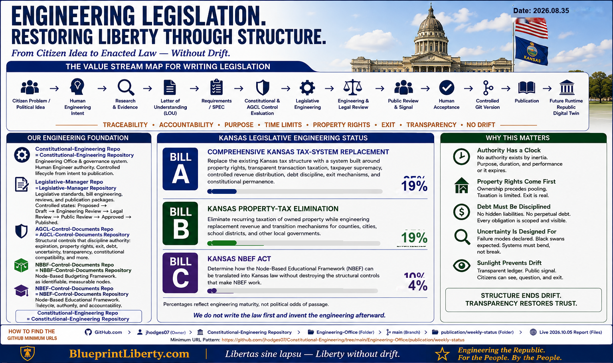

# BlueprintLiberty Weekly Public Engineering Status

**Status Date:** 2026.08.35  
**Calendar Date:** 2026-08-30  
**Publication Week:** ISO week 35 of 2026 (calendar year/month 2026-08)  
**Package Class:** Weekly Public Engineering Status  
**Governing Work Card:** CWC-CE-085 — First Phone-Originated KSB Status POC  
**Governing CONTROL:** STD-011 Version 1.3.0 Part B; WSMAT-001 Version 1.0.0  

---

## Engineering Maturity (Human-Certified)

| Bill | Public Title | Certified Engineering Maturity |
|---|---|---|
| **Bill A** | COMPREHENSIVE KANSAS TAX-SYSTEM REPLACEMENT | **19%** |
| **Bill B** | KANSAS PROPERTY-TAX ELIMINATION | **19%** |
| **Bill C** | KANSAS NBEF ACT (Node-Based Educational Framework) | **4%** |

These percentages are **CERTIFIED KSB MATURITY** values under STD-011 §27 / WSMAT-001 for this status cycle.

- Calculated under Active WSMAT-001 from controlled evidence (`KSB-MATURITY-CALC-001-CWC-CE-085.md`).  
- Human Engineer disposition: **ACCEPT** for all three (`KSB-MATURITY-CERT-001-CWC-CE-085.md`).  
- They measure verified progress through the controlled legislative engineering Value Stream Map.  
- They do **not** mean LOU accepted, SPEC approved, bill introduced, bill enacted, or political support.

---

## Concise Public Narrative

BlueprintLiberty’s first phone-originated Kansas BlueprintLiberty Status package reports engineering maturity for three Kansas legislative engineering objects under active Constitutional Engineering Office controls.

Bills A and B share a Draft Letter of Understanding (LOU-001 Draft 0.3) that remains **not Human-accepted**. Bill C is identified by its public title pin; a Bill C legislative LOU has not been accepted. Hard gate HG-D1 remains unsatisfied for all three bills. Downstream maturity stages that require accepted LOU authority therefore receive no maturity credit.

---

## Evidence References

| Reference | Role |
|---|---|
| `KSB-MATURITY-CALC-001-CWC-CE-085.md` | Evidence snapshot + calculated maturity ledgers |
| `KSB-MATURITY-CERT-001-CWC-CE-085.md` | Human certification record |
| `WSMAT-001-KSB-Status-Maturity-Measurement.md` | Active maturity algorithm |
| `STD-011` v1.3.0 Part B | Packaging / percentage authority |
| `ECR-005` | Maturity-control change record |
| `definition/LOU-001-…` Draft 0.3 | Recognized draft LOU (NOT ACCEPTED) for Bills A/B |
| Baseline `BL-WEEKLY-STATUS-BASELINE-v1.0` | Immutable visual baseline SHA-256 `17F574D4…` |
| Repository evaluation HEAD | `c99c0b33ef3f923e979a8136cad1e8f07ab42dba` (pre-commit) |

---

## Human Acceptance State

| Item | State |
|---|---|
| Maturity percentages | **HUMAN CERTIFIED** (ACCEPT) |
| Weekly package generation | Authorized under CWC-CE-085 for local generation/validation |
| LOU HG-D1 (Bill A/B/C) | **NOT PASSED** |
| Package Git advancement | **PENDING Human Git gate** |
| Publication (HG-6) | **NOT AUTHORIZED** |

---

## Publication Authorization State

**NOT AUTHORIZED.**

Generation is not publication. Facebook, website upload, social posting, email release, and public LOU review are not authorized by this package alone.

---

## Learn More / Project URLs

- [BlueprintLiberty.com](https://BlueprintLiberty.com)

---

## Git Traceability

Post-commit Git SHA: *not available — package not yet committed*

Manifest: `../manifests/2026-08-30-BlueprintLiberty-Weekly-Status.md`
